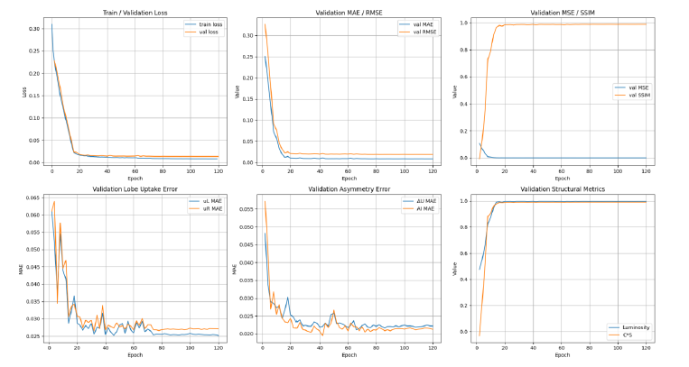
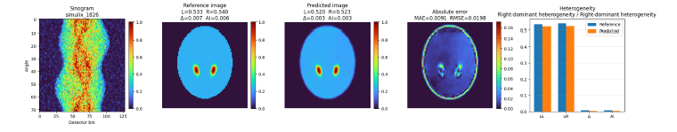
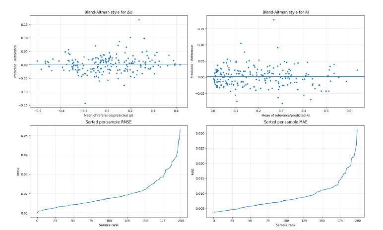
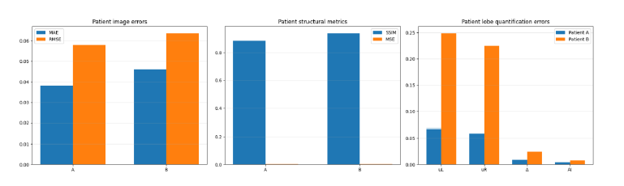
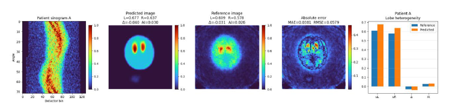
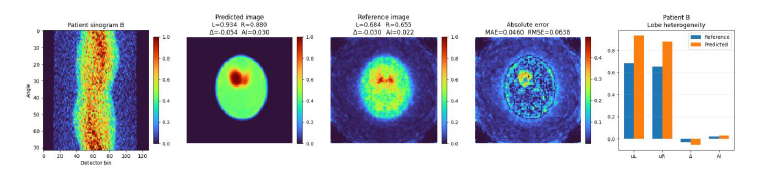

# Medical Image Reconstruction using FBP and Residual U-Net

This repository contains a deep learning-based medical image reconstruction pipeline developed in Python using PyTorch.

The project focuses on reconstructing 2D medical images from sinogram data. It first applies Filtered Back Projection (FBP) to generate a baseline reconstruction and then uses a Residual U-Net neural network to refine the image and improve reconstruction quality.

## Project Overview

Medical image reconstruction is a key problem in computational imaging. In many imaging systems, the measured data are stored in the form of sinograms, which represent projection measurements acquired from different angles.

In this project, sinogram files are used as input data and corresponding reconstructed images are used as reference targets. The goal is to train a deep learning model that improves the quality of the baseline FBP reconstruction.

The pipeline includes:

- Loading sinogram data from `.sin` files
- Loading reference images from `.mtx` files
- Preprocessing and normalization of imaging data
- Filtered Back Projection reconstruction
- Patient-like noise and degradation simulation
- Residual U-Net-based image refinement
- Training, validation, and testing of the model
- Quantitative evaluation using image similarity metrics
- Comparison with reference MLEM reconstructions

## Methodology

The reconstruction process begins by converting the sinogram data into an initial image using Filtered Back Projection. This image is used as the input to a Residual U-Net model.

The network learns a correction over the baseline reconstruction. Instead of reconstructing the image completely from scratch, the model refines the FBP result by learning residual image features. This approach combines classical reconstruction methods with deep learning-based enhancement.

The model is trained using paired data:

- Input: FBP reconstruction generated from sinogram data
- Target: Reference reconstructed image

## Model Architecture

The deep learning model is based on a Residual U-Net architecture implemented in PyTorch.

The architecture includes:

- Convolutional blocks
- Batch normalization
- ReLU activations
- Downsampling path
- Upsampling path
- Skip connections
- Residual correction over the FBP input

The model produces a refined reconstructed image with a size of 90 × 90 pixels.

## Loss Function

The training loss combines multiple image-quality terms:

- Weighted L1 reconstruction loss
- SSIM-based structural similarity loss
- Edge preservation loss
- Local contrast loss

This allows the model to optimize not only pixel-level accuracy, but also structural similarity, edge information, and image contrast.

## Evaluation Metrics

The reconstructed images are evaluated using several quantitative metrics:

- Mean Absolute Error
- Mean Squared Error
- Root Mean Squared Error
- Structural Similarity Index
- Luminosity comparison
- Contrast and structure comparison

The model output is compared both with the target test images and with reference MLEM reconstructions for selected patient-like cases.

## Patient Comparison

The code includes a comparison stage for patient sinogram files. For each patient case, the pipeline:

1. Loads the patient sinogram
2. Generates an FBP baseline reconstruction
3. Applies the trained Residual U-Net model
4. Saves the deep learning reconstruction
5. Compares the result with a reference MLEM image
6. Reports quantitative differences between baseline and deep learning reconstruction

The comparison includes MAE, RMSE, SSIM, luminosity, and contrast-structure metrics.

## Technologies Used

- Python
- PyTorch
- NumPy
- SciPy
- scikit-image
- Matplotlib
- Google Colab
- Google Drive integration

## Google Colab Environment

This project was developed and tested in Google Colab. Google Colab was used for GPU acceleration and for direct integration with Google Drive, where the datasets and output results are stored.

The code mounts Google Drive, loads imaging data, performs preprocessing, trains the neural network, visualizes results, and saves trained models and comparison summaries.

## Results

### Training and validation loss


### Reconstruction comparison


### Quality metrics during training


### Quantitative metrics comparison


### Reconstruction comparison — real-life patient A


### Reconstruction comparison — real-life patient B


## Repository Structure

```text
medical-image-reconstruction-fbp-unet/
├── reconstruction_fbp_unet.py   # Main reconstruction and training pipeline
├── README.md                    # Project documentation
├── requirements.txt             # Python dependencies
└── .gitignore                   # Files and folders excluded from GitHub


